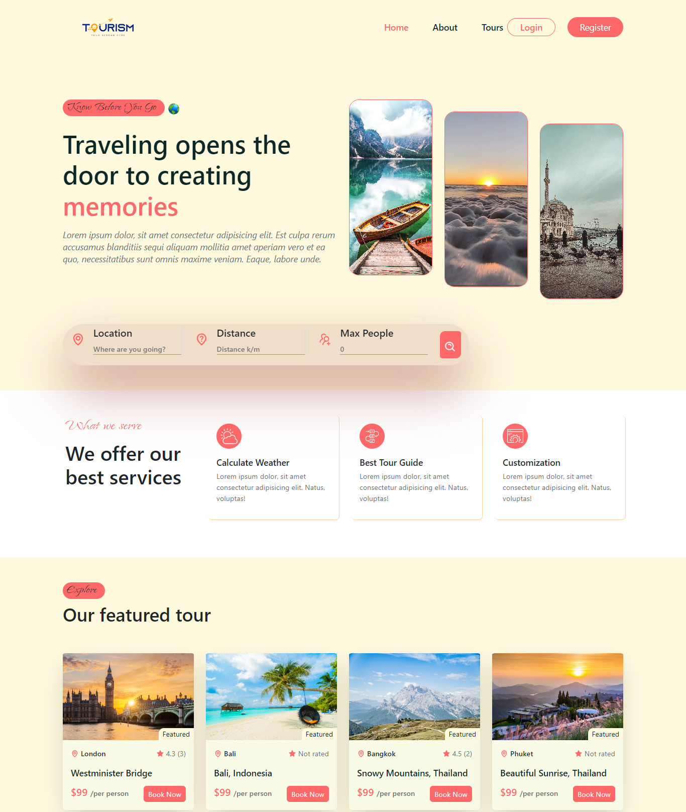

# Tours and Travel Booking Website

This is a tours and travel booking website built with Node.js, Express.js, MongoDB, React, and Vite.js.

## Images for Home page



## Description

This website provides a platform for users to book tours and travel packages. It consists of two main components:

## API:

The API server built with Node.js and Express.js handles the backend logic, data storage in MongoDB, also user authentication, and search functionality.

## Client:

The client-side application built with React and Vite.js provides the user interface and interacts with the API to fetch data and perform various actions.

## Features

- User authentication and validation API for secure user registration and login.
- Search system feature to find tours based on different criteria.
- Pagination to display tour results in a manageable way.
- Newsletter option for users to subscribe and receive updates.
- Home page: Displays featured tours and provides a search form.
- About page: Provides information about the company and its mission.
- Tour page: Displays details about a specific tour.

## Installation

1. Clone the repository: `git clone https://github.com/developer-shajib/Tours-and-Travel-Booking`
2. Install dependencies for API: `cd api && npm install`
3. Install dependencies for Client: `cd client && npm install`

## Configuration

1. API Configuration:
   - Create a `.env` file in the `api` directory.
   - Set the following environment variables:
     ```
     PORT=5050
     MONGO_URI = <your_mongodb_uri>
     JWT_SECRET= <your_secret_key>
     ```
2. Client Configuration:
   - Create a `.env` file in the `client` directory.
   - Set the following environment variables:
     ```
     APP_URI =http://localhost:5173
     BASE_URI = http://localhost:5050/api/v1
     ```

## Usage

1. Start the API server:

   - Go to the `api` directory: `cd api`
   - Run the server: `npm start`
   - The API server will start running on `http://localhost:5050`.

2. Start the client application:
   - Go to the `client` directory: `cd client`
   - Run the application: `npm run dev`
   - The client application will be accessible at `http://localhost:5173`.

## Contributing

Contributions are welcome! If you have any suggestions or improvements, please create an issue or submit a pull request.

## Live Link

Backend: deployed in Render
Frontend: deployed in Netlify

[Live Link](https://tour-travel-booking.vercel.app)

## License

This project is licensed under the [MIT License](LICENSE).
